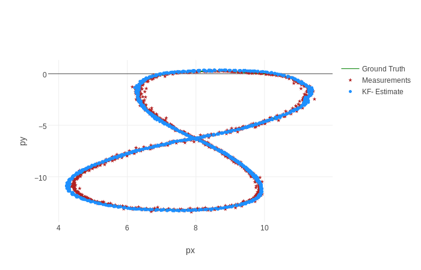

# LIDAR and RADAR Data Fusion with Extended Kalman Filter

## Introduction

In this project, a stream of simulated mixed LIDAR and RADAR data will be used to estimate the trajectory of a car moving in curved trajectory. The theory and formulas used in this project can be found [here](../KalmanFIlter.pdf).

## Basic results

The results for two data sets with a basic EKF implementation are shown below.

* [Test data 1](./data/sample-laser-radar-measurement-data-1.txt)

| RMSE  | LIDAR and RADAR | LIDAR only | RADAR only |
| :-------: | :------------------------: | :--------------: | :--------------: |
| x        |  0.065                 | 0.069                 |  0.101                 |
| y         | 0.063                 | 0.058                |  0.082                 |
| vx       | 0.53                   | 0.63                 |  0.60                 |
| vy       | 0.54                   | 0.56                 |  0.58                 |

*[Test data 2](./data/)

| RMSE  | LIDAR and RADAR | LIDAR only | RADAR only |
| :-------: | :------------------------: | :--------------: | :--------------: |
| x        |  0.185                 |  0.218       |  177          |
| y         | 0.190                |   0.194       |  22            |
| vx       | 0.48                   |   0.94        |  2.13         |
| vy       | 0.80                   |   0.83        |  0.77         |

## Discussion

As shown above, the LIDAR data set itself is already good enough. The RADAR data set can slight reduce the RMSE. It is worth noting that for the second data set, the improvement on `vx` is significant.