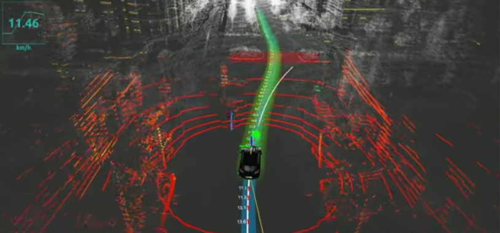

# Sensor Fusion with Kalman Filter
Jun Zhu

Sensor fusion with different implementions of Kalman filter.

A stream of simulated mixed LIDAR and RADAR data will be used to estimate the trajectory of a car moving in curved trajectory.

## LIDAR and RADAR Data Fusion with Extended Kalman Filter

Details can be found [here](./EKF).

## LIDAR and RADAR Data Fusion with Uncented Kalman Filter

Details can be found [here](./UKF).