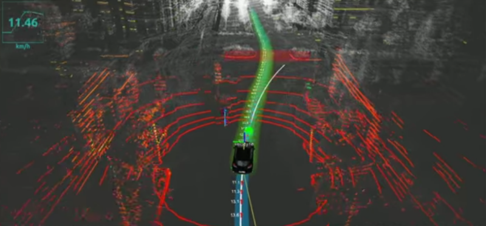
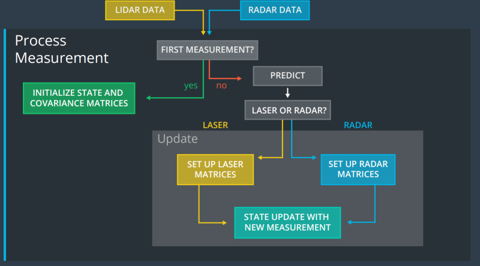

# Sensor Fusion with Kalman Filter
Jun Zhu

Sensor fusion with different implementions of Kalman filter.

A stream of simulated mixed Lidar and Radar data will be used to estimate the 
trajectory of a car moving in curved trajectory. The theory used in this project 
is summarized [here](./KalmanFilter.pdf)

## Lidar and Radar Data Fusion with Extended Kalman Filter

Details can be found [here](./EKF).

## Lidar and Radar Data Fusion with Uncented Kalman Filter

Details can be found [here](./UKF).
