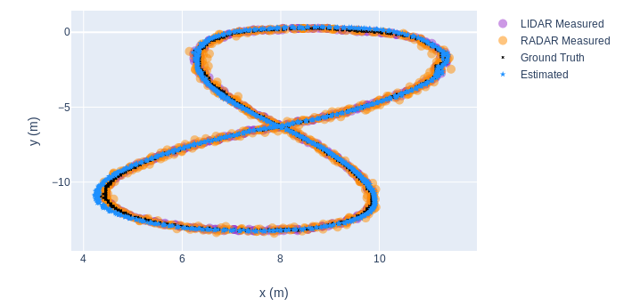
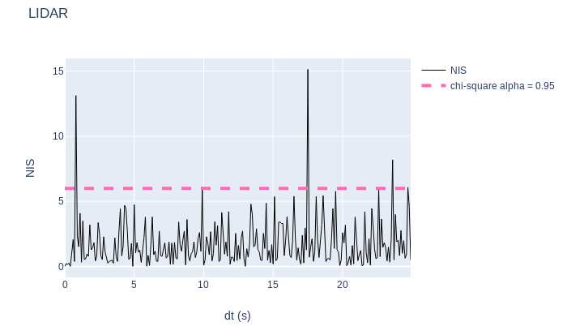

# Sensor Fusion with Kalman Filter
Jun Zhu

Sensor fusion with different implementions of Kalman filter.

A stream of simulated mixed Lidar and Radar data will be used to estimate the 
trajectory of a car moving in curved trajectory. The theory used in this project 
is summarized [here](./KalmanFilter.pdf)

### [1] [Extended Kalman Filter](./EKF) (LIDAR and RADAR)

### [2] [Uncented Kalman Filter](./UKF) (LIDAR and RADAR)

### [3] [LIDAR Obstacle Detection](./SFND_Lidar_Obstacle_Detection)
