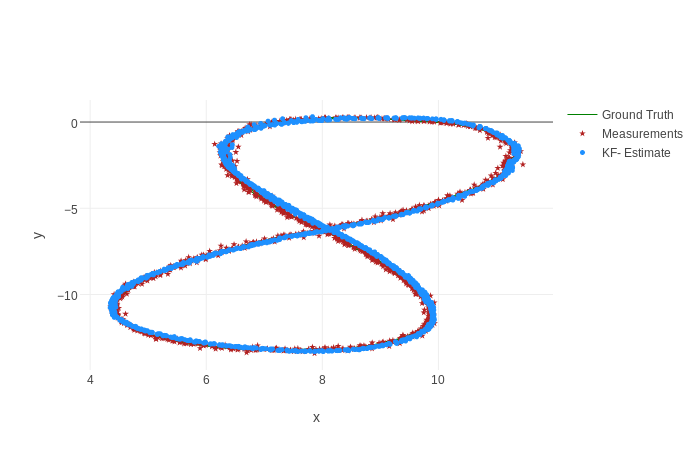
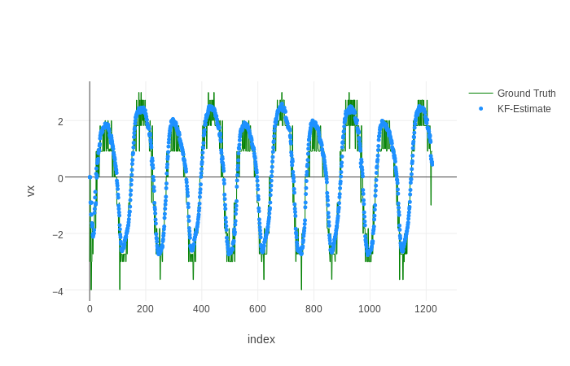
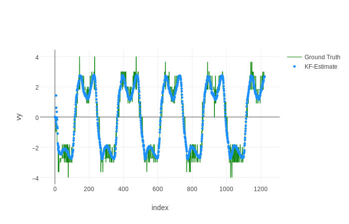
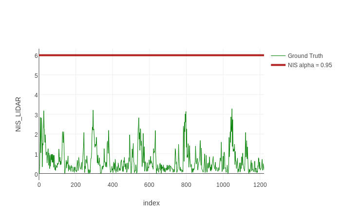
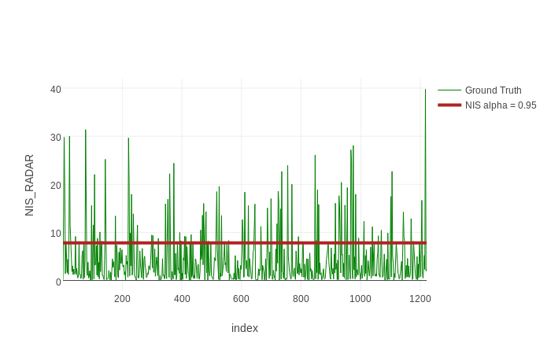
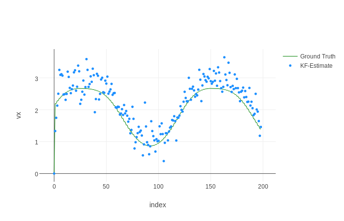
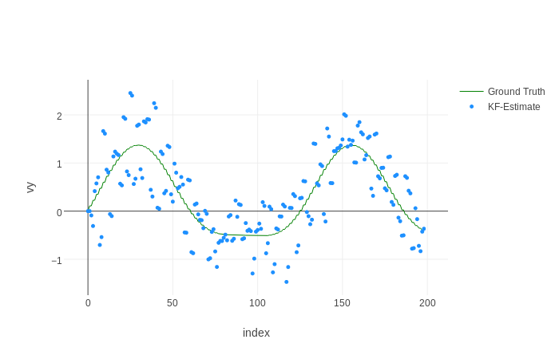
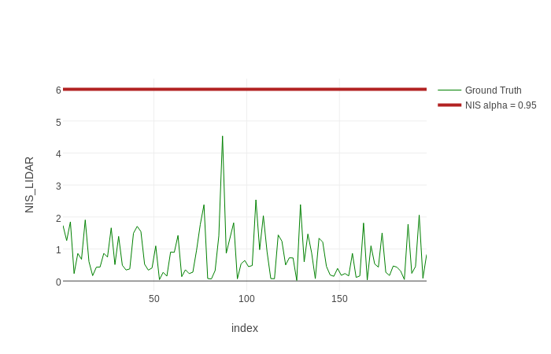
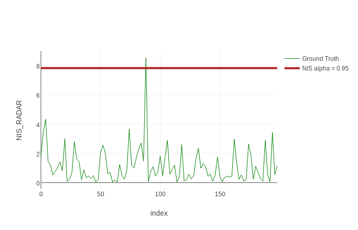

# LIDAR and RADAR Data Fusion with Unscented Kalman Filter
[](http://www.udacity.com/drive)
[](https://travis-ci.org/zhujun98/sensor-fusion)

Jun Zhu

## Introduction

In this project, a stream of simulated mixed LIDAR and RADAR data will be used to estimate the trajectory of an object moving in a curved trajectory by using the unscented Kalman filter for both data sets. The theory and formulas used in this project are summarized [here](../KalmanFilter.pdf). The measurement noises for the LIDAR data are $\sigma_x$ = $\sigma_y$ = 0.15 m. The measurement noises for the RADAR data are $\sigma_r$ = 0.30 m, $\sigma_\phi$ = 0.03 rad and $\sigma_\dot{r}$ = 0.3 m/s. 

The motion model used in this project is the __CTRV (constant turn rate and velocity)__ model, as shown below:


## Dependencies

#### [Eigen](http://eigen.tuxfamily.org/index.php?title=Main_Page) >= 3.3.3

```shell script
$ git clone --branch 3.3.7 https://github.com/eigenteam/eigen-git-mirror.git
$ cd eigen-git-mirror
$ mkdir build && cd build
$ cmake .. && make install
```

## Simulation results

The results for two data sets with UKF implementation are shown below.

* [Test data 1](./data/sample-laser-radar-measurement-data-1.txt)

RMSE  | LIDAR and RADAR 
-------    | ------------------------
x         |  0.072
y         | 0.080
vx       | 0.59
vy       | 0.58







*[Test data 2](./data/sample-laser-radar-measurement-data-1.txt)

RMSE  | LIDAR and RADAR 
-------    | ------------------------
x         |  0.19
y         | 0.19
vx       | 0.39
vy       | 0.52








## Summary

Due to the discrepancy between these two data sets, it is difficult to tune the acceleration noise and yaw acceleration noise to meet the NIS requires of both data sets. As a compromise, an acceleration noise of 0.7 m/s^2 and a yaw acceleration noise of 0.6 rad/s^2 are used here.
